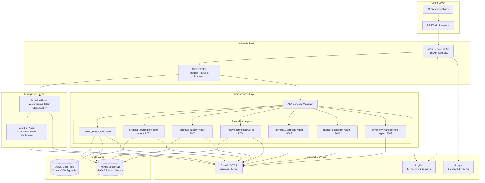
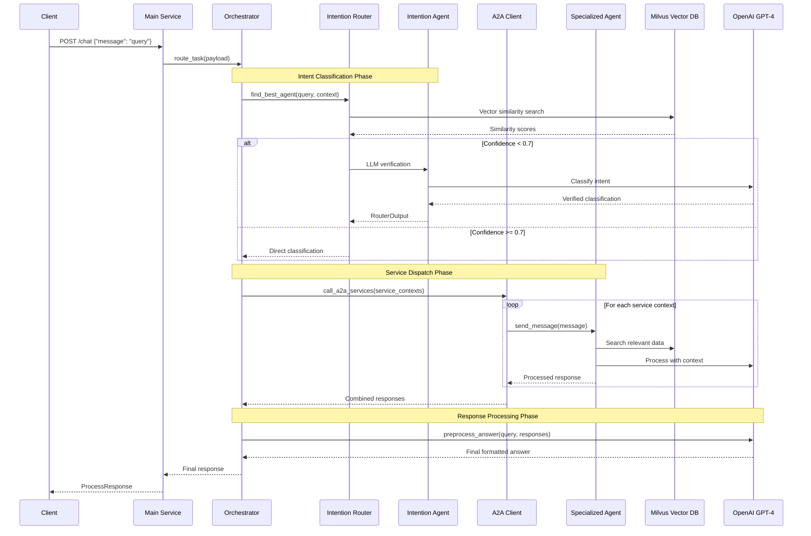
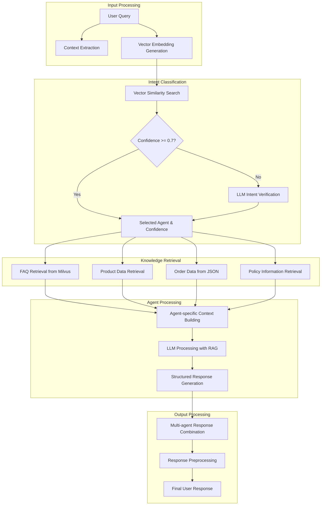
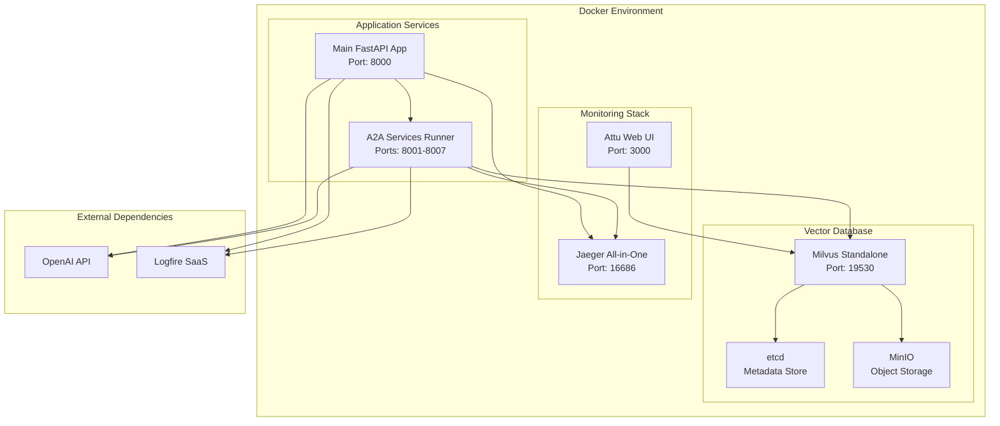
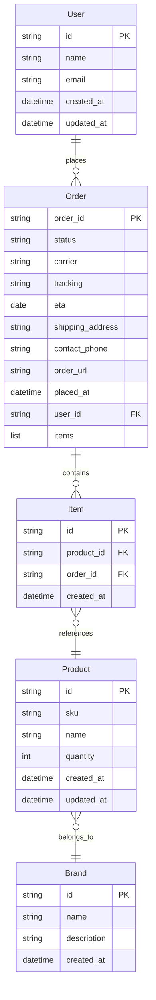
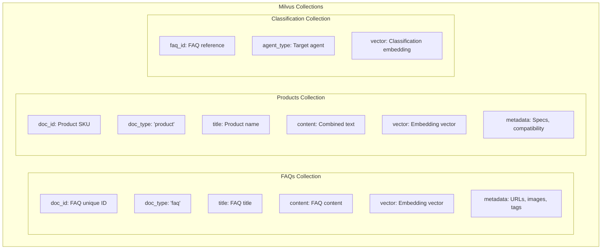

# AI Agent CRM Architecture Documentation

## Project Overview

AI Agent CRM is an intelligent customer service system designed for JTCG Shop (工作空間配件專門店), specializing in monitor arms, wall mounts, and workspace accessories. The system uses a microservices architecture with specialized AI agents to handle different types of customer inquiries.

## System Architecture

### High-Level Architecture



### Request Flow Architecture



### Data Flow Architecture



## Component Details

### 1. Main Service (`main.py`)
- **Purpose**: FastAPI gateway service
- **Port**: 8000
- **Responsibilities**:
  - Handle incoming HTTP requests
  - Route to orchestrator
  - Return formatted responses
  - Logging and error handling

### 2. Orchestrator (`orchestrator.py`)
- **Purpose**: Central coordination service
- **Responsibilities**:
  - Intent classification coordination
  - A2A service orchestration
  - Response preprocessing
  - Context management

### 3. Intention System (`intentions/`)

#### IntentionRouter (`intentions/router.py`)
- **Purpose**: Vector-based intent classification
- **Technology**: SentenceTransformer + numpy
- **Features**:
  - Multi-language support (paraphrase-multilingual-MiniLM-L12-v2)
  - Context-aware scoring adjustments
  - Similarity threshold filtering
  - Fallback to human escalation

#### IntentionAgent (`intentions/agent.py`)
- **Purpose**: LLM-based intent verification
- **Model**: GPT-4
- **Use Case**: Low confidence intent classification verification

### 4. Specialized Agents (`agents/`)

Each agent follows the same pattern:
- Pydantic AI Agent with OpenAI GPT-4.1
- Tool-based architecture for data retrieval
- Vector search integration (Milvus)
- Structured response formatting

#### Agent Details:

| Agent | Port | Primary Function | Data Sources |
|-------|------|------------------|--------------|
| Order Query Agent | 8001 | Order status, tracking, history | JSON files, FAQ database |
| Product Recommendation Agent | 8002 | Product suggestions, compatibility | Product database, specifications |
| Technical Support Agent | 8003 | Installation help, troubleshooting | FAQ database, technical docs |
| Policy Information Agent | 8004 | Returns, warranty, invoicing | Policy database |
| Payment & Shipping Agent | 8005 | Payment methods, shipping info | Shipping policies, payment options |
| Human Escalation Agent | 8006 | Complex queries, escalation | N/A (routes to human support) |
| Inventory Management Agent | 8007 | Stock status, availability | Inventory database |

### 5. Data Storage Layer

#### Milvus Vector Database
- **Collections**:
  - `faqs`: FAQ content with vector embeddings
  - `products`: Product information with embeddings
  - `classification`: Agent-FAQ mapping relationships

#### JSON Data Files
- `orders.json`: Order information database
- `intentions.json`: Intent classification examples
- `custom.json`: Custom configuration data

### 6. Core Services (`cores/`)

#### Settings (`cores/settings.py`)
- Environment variable management
- Configuration centralization
- API key handling

#### Constants (`cores/constants.py`)
- Service endpoint definitions
- A2A service URL mapping

#### Storage (`cores/storages.py`)
- Milvus client management
- Vector embedding generation
- CRUD operations for vector data

### 7. A2A (Agent-to-Agent) Communication

The system uses the FastA2A framework for agent communication:
- Asynchronous message passing
- Task-based execution
- Standardized message formats
- Service discovery and routing

## Key Design Patterns

### 1. Microservices Architecture
- Each agent runs as an independent service
- Horizontal scaling capability
- Service isolation and fault tolerance

### 2. RAG (Retrieval-Augmented Generation)
- Vector similarity search for relevant information
- Context injection into LLM prompts
- Knowledge base integration

### 3. Multi-Agent Orchestration
- Centralized coordination through orchestrator
- Context-aware agent selection
- Multi-agent response synthesis

### 4. Event-Driven Architecture
- Asynchronous processing
- Task queuing and management
- Real-time monitoring and logging

## Technology Stack

### Backend Framework
- **FastAPI**: Modern, fast web framework
- **Pydantic**: Data validation and settings management
- **Pydantic AI**: AI agent framework

### AI/ML Components
- **OpenAI GPT-4/4.1**: Large language models
- **SentenceTransformers**: Text embedding generation
- **Milvus**: Vector database for similarity search
- **NumPy**: Numerical computing

### Infrastructure
- **Docker**: Containerization
- **Docker Compose**: Multi-container orchestration
- **Uvicorn**: ASGI server

### Monitoring & Observability
- **Logfire**: Application monitoring
- **Jaeger**: Distributed tracing
- **OpenTelemetry**: Observability framework

### Development & Testing
- **Pytest**: Testing framework
- **Poetry**: Dependency management (planned migration)

## Configuration

### Environment Variables
```bash
OPENAI_API_KEY=your_api_key
OTEL_EXPORTER_OTLP_ENDPOINT=http://localhost:4318
OTEL_SERVICE_NAME=ai-agent-crm-dev
AGENT_URL=http://localhost
TOKENIZERS_PARALLELISM=false
MILVUS_URI=http://localhost:19530
```

### Service Ports
- Main Service: 8000
- Order Query Agent: 8001
- Product Recommendation Agent: 8002
- Technical Support Agent: 8003
- Policy Information Agent: 8004
- Payment & Shipping Agent: 8005
- Human Escalation Agent: 8006
- Inventory Management Agent: 8007

### External Services
- Milvus: 19530
- Jaeger UI: 16686
- Attu (Milvus Admin): 3000
- OTLP Collector: 4318

## Deployment Architecture



## Data Models

### Core Entities



### Vector Data Structure



## API Documentation

### Main Endpoints

#### POST `/chat`
Process customer queries and return AI-generated responses.

**Request:**
```json
{
    "message": "查詢我的訂單狀態"
}
```

**Response:**
```json
{
    "status": "success",
    "result": "根據您的查詢，我需要您的用戶ID來為您查詢訂單資訊...",
    "error": null
}
```

## Performance Considerations

### Scalability
- Horizontal scaling of individual agent services
- Vector database sharding for large datasets
- Async processing for better throughput

### Optimization
- Vector embedding caching
- Intent classification result caching
- Connection pooling for external services

### Monitoring
- Response time tracking
- Agent performance metrics
- Vector search latency monitoring

## Security Considerations

### API Security
- API key management through environment variables
- Request validation using Pydantic models
- Error handling without sensitive data exposure

### Data Protection
- No hardcoded credentials
- Environment-based configuration
- Secure vector database access

## Future Enhancements

### Planned Features
1. **Database Integration**: Replace JSON files with PostgreSQL
2. **Advanced RAG**: Implement hybrid search (vector + keyword)
3. **Multi-language Support**: Extend beyond Chinese/English
4. **Real-time Learning**: Dynamic intent model updates
5. **A/B Testing**: Intent classification model comparison

### Scalability Improvements
1. **Load Balancing**: Agent service load distribution
2. **Caching Layer**: Redis integration for performance
3. **Queue System**: Async task processing with Celery
4. **Model Serving**: Dedicated embedding service

## Troubleshooting Guide

### Common Issues

1. **Module Import Errors**
   - Solution: Set `PYTHONPATH` to project root
   - Alternative: Install package in development mode

2. **Vector Database Connection**
   - Check Milvus service status
   - Verify connection URI configuration

3. **Agent Communication Failures**
   - Verify all A2A services are running
   - Check service port accessibility

### Development Setup
```bash
# Set environment variables
export PYTHONPATH=$PWD
source .env

# Start infrastructure
docker compose up -d

# Run services
python3 a2a_services.py &  # Background process
python3 main.py           # Main service
```

This architecture provides a robust, scalable, and maintainable foundation for the AI Agent CRM system, with clear separation of concerns and comprehensive monitoring capabilities.